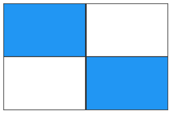
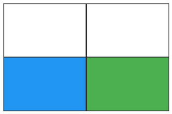

# Избор на действие

Проверката за качество на софтуерни продукти често се извършва посредством автоматизирани, полуавтоматизирани или ръчно изпълняващи се тестове. Основна цел при създаване и изпълнение на тези тестове е постигане на високо или пълно покритие на програмен код [@zhu1997software]. От своя страна, това покритие повишава възможността програмата да не достига непредвидени състояния и притежава желаната функционалност [@ohba1982software].

Създаването на тестове, които проверяват цялостната функционалност на системата често се извършва от специалисти по проверка на качеството (QA). Те създават автоматизирани или ръчно изпълняват тестове, спрямо предварително създадени спецификации. Част от тестовете, обхващащи целият софтуерен продукт се извършват спрямо графичната потребителски интерфейс (ГПИ), който той предоставя. Тези тестове (наречени ГПИ тестове (GUI tests) симулират взаимодействието на потребител с програмата.

Създаването на автоматизирани ГПИ тестове е обвързано с трудности, като често променящи се визуални елементи, забавено изпълнение, достигане на непредвидени състояния на средата и др. [@memon2002gui]. Често, поради тази причини подобен вид тестове се изпълняват изцяло ръчно или полуавтоматизирано, което изисква взаимодействие с експерт.

QA експертът взаимодейства с ГПИ чрез поредица от действия (извършени чрез мишка, клавиатура, докосвания върху екран и/или др.), които променят ГПИ и водят до друго състояние (в частност, нов екран). Когато това състояние не е наблюдавано до момента, покритието на програмен код се увеличава, поради нуждата от изпълнение му за създаване на самото състояние.

Тогава, целта при създаване на ГПИ тестове може да се определи като посещаване на всяко състояние на визуалната среда поне веднъж. Повторно наблюдение на дадено състояние може да е необходимо поради допълнителни възможни действия. Действията, които се избират, определят последователността на наблюдаваните състояния, както и бързодействието на текущия тест (минимален брой на взети действия за постигане на целта).

В тази част от работата ще създадем модел, който избира следващо действие, когато средата се намира в определено състояние. Това действие трябва да бъде избрано, така че да максимизира увеличението на покритие на програмен код и минимизира нуждата възможността за попадане във вече наблюдавано състояние. Състоянието на средата ще бъде закодирано чрез матрица, отговаряща на елементите в нея. Това е опростен подход към решаване на поставената задача, като той ще бъде разширен в следващата глава.

Решаването на задачата използва т.нар подход базиран на наличните данни (data-driven). Конкретно, създаваме БИНМ, която приема състоянието на средата като входни параметри и изчислява апостериорно разпределение за оценката на (до колко добро е) всяко от възможните действия. Обучението на модела се извършва чрез предварително събрани данни.

## Литературен обзор

Съществуват различни подходи за автоматизирано създаване на ГПИ тестове за мобилни и уеб приложения: [@amalfitano2015mobiguitar], [@choi2013guided], [@moreira2014gui], [@salvesen2015using], [@moreira2017pattern] [@memon2002gui], но тяхната практическа употреба и ефективност са незадоволителни [@choudhary2015automated].

Предложеният подход е вдъхновен от:
- [@mnih2015human] - използват се ИНМ за обучение на агент, който играе игри, надвишавайки възможностите на човек на някои от тях 
- [@pmlr-v70-shi17a] - среда, предоставяща възможност за създаване и обучение на агенти, изпълняващи задачи в уеб среди (напр. закупуване на самолетен билет)
- [@chang2010gui] - визуален скриптов език за създаване на тестове, който използва изображения за определяне на следващо действие

Текущият подход се различава по, това че:

- автоматизира напълно (или в голяма степен) създаването на ГПИ тестове
- предоставя среда, даващата информация за новото покритие на код при взимане на действие
- оценя несигурността за избиране на действие, което може да е полезно за:
  - Състояния в които е необходима допълнителна информация за да бъде продължено изучаването на средата (напр. екран изискваш потребителско име и парола)   
  - достигнато е неочаквано състояние (аномалия), което може да е свързано с грешка в програмният код

## Модел

Нека имаме среда $E$, намираща се в състояние $s \in \mathbb{S}$, върху което могат да бъдат изпълнени действия от множеството от действия $\mathbb{A}$. При избор на действие $a \in \mathbb{A}$, средата $E$ предоставя награда $r$, която приема стойности в интервала $[0; 1]$ и преминава в ново състояние $s'$ (в частност, $s' = s$, т.е. средата може да  не премине в ново състояние). Множеството $\mathbb{A}$ е ненаредено и всяко $a \in \mathbb{A}$ може да се обозначи с единствено цяло число, като по този начин въвеждаме наредба в $\mathbb{A}$. Всяко състояние на средата $S$ позволява изпълнението на действия $\mathbb{A}$, които са предварително дефинирани. Множеството от всички възможни състояния на средата $\mathbb{S}$ е неизвестно.

Нека след първоначално обучение от специалист имаме матрица на преходите $D$ с размерност $n \times 3$, където $n$ е броя на преходите. Всеки ред от $D$ дефинира наредена тройка $(състояние, действие, награда)$, която описва получените награди при изпълнение на съответното действие за даденото състояние.

Нека имаме състояние $s'$, за което $D$ не съдържа информация. В този случай, целта е да намерим подмножеството от действията, така че изпълнението им да води до получаване на оптимална награда от средата $E$.

Задачата е решена, когато $D$ съдържа информация за всички състояния $s \in \mathbb{S}$.

## Пример

Експертът е обучил ... като се стреми да посети всяко състояние поне по веднъж и минимизира избраните действия.

Нека имаме визуална среда с 5 възможни действия:

- $a_1$ - клик горе в ляво
- $a_2$ - клик горе в дясно
- $a_3$ - клик долу в ляво
- $a_4$ - клик долу в дясно
- $a_5$ - връщане назад

Нека след първоначално обучение от специалист качество на софтуер (QA expert) имаме матрицата на преходите D, дефинирана като:

| $s_{x_1}$ | $s_{x_2}$ | $s_{x_3}$ | $s_{x_4}$ | action | reward |
|-----------|-----------|-----------|-----------|--------|--------|
| b         | w         | g         | g         | $a_3$  | 0.25   |
| b         | w         | w         | b         | $a_5$  | 0.00   |
| b         | w         | g         | g         | $a_4$  | 0.25   |

където:

- $s = (s_{x_1}, s_{x_2}, s_{x_3}, s_{x_4})$ е вектор от характеристиките на състоянието
- w - бял цвят, върху който не могат да бъдат предприемани действия
- b - син цвят, който представя текстова информация
- g - зелен цвят, който представя бутон

Първото състояние (първият ред от матрицата $D$) може да се визуализира като:

Избрано е действие $a_3$ за което е получена награда $0.25$. Средата преминава в ново състояние (втори ред от $D$):

Тук е избрано действие $a_5$ - връщане назад и получаваме награда 0. Това ни връща в първоначалното състояние:

Тук сме избрали $a_4$ и сме получили награда от $0.25$. Получаваме ново състояние:

Получихме ново състояние, което не е описано в $D$. Свеждаме задачата до избор на действие, което ще ни даде максимална награда за текущото състояние.

## Обучение на модела

Задачата се свежда до намиране на действие, което предоставя най-висока награда за текущото състояние. Допълнително, вероятностното разпределение над всички възможни действия би позволило оценяване на несигурността при избор на действие. С тази информация може да решим кога да използваме знанията за средата и кога да я изучаваме []. Когато вероятността е по-голяма ще е по-вероятно да изберем конкретното действие.

### Бейсова невронна мрежа (БНМ)

## Експерименти

## Заключение
